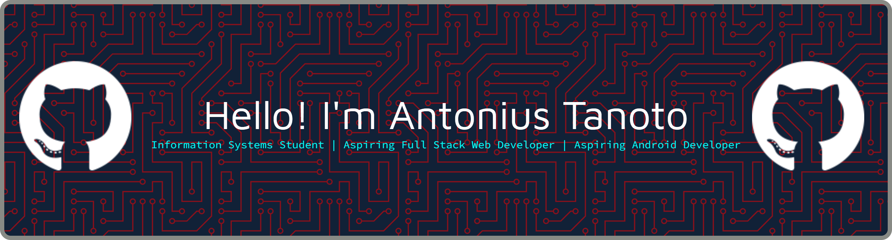

# 👋 Hello!, I'm Antonius Tanoto

### Information Systems Student | Full Stack Web Developer | Android Developer

I'm an Information Systems student who enjoys building digital solutions that solve real-world problems. I have experience developing web applications using Laravel and creating Android applications with Java. I am passionate about software development, UI/UX design, and continuously learning new technologies.

---

## 🚀 About Me

* 🎓 Information Systems Student
* 💻 Interested in Full Stack Web Development
* 📱 Android Application Developer (Java)
* 🎨 Passionate about UI/UX Design
* 🌱 Currently learning modern web technologies
* 🎯 Goal: Build impactful digital products that improve everyday life

---

## 🛠️ Tech Stack

### Programming Languages

### Frameworks & Libraries

### Mobile Development

### Database

### Tools

---

## 📂 Featured Projects

### 🍽️ DineReserve

A restaurant reservation system developed with Laravel that streamlines table booking and restaurant management.

**Repository:**
🔗 https://github.com/Antonius898/dinereserve

**Features**

* User Authentication
* Restaurant Management
* Table Reservation
* Reservation History
* Responsive Dashboard

**Tech Stack**

* Laravel
* Blade
* MySQL
* Bootstrap
* Tailwind CSS

---

### 🐾 PetCare App

An Android application designed to simplify pet care services, including hotel bookings and grooming reservations.

**Repository:**
🔗 https://github.com/vicenzomoy/PetCareApp

**Features**

* Pet Profile Management
* Pet Hotel Booking
* Grooming Reservation
* Room Database Integration

**Tech Stack**

* Java
* Android Studio
* SQLite
* Room Database

---

### 💰 SI UMKM

A simple financial management system for small and medium-sized businesses (SMEs) to record income, expenses, and generate financial reports.

**Repository:**
🔗 https://github.com/Antonius898/siumkm

**Features**

* Income & Expense Management
* Financial Reports
* Dashboard
* User Authentication

**Tech Stack**

* Laravel
* Blade
* MySQL
* Bootstrap

---

## 📫 Connect With Me

  

---

⭐ Thanks for visiting my profile! Feel free to explore my repositories and connect with me.

<!--
**Antonius898/Antonius898** is a ✨ _special_ ✨ repository because its `README.md` (this file) appears on your GitHub profile.

Here are some ideas to get you started:

- 🔭 I’m currently working on ...
- 🌱 I’m currently learning ...
- 👯 I’m looking to collaborate on ...
- 🤔 I’m looking for help with ...
- 💬 Ask me about ...
- 📫 How to reach me: ...
- 😄 Pronouns: ...
- ⚡ Fun fact: ...
-->
